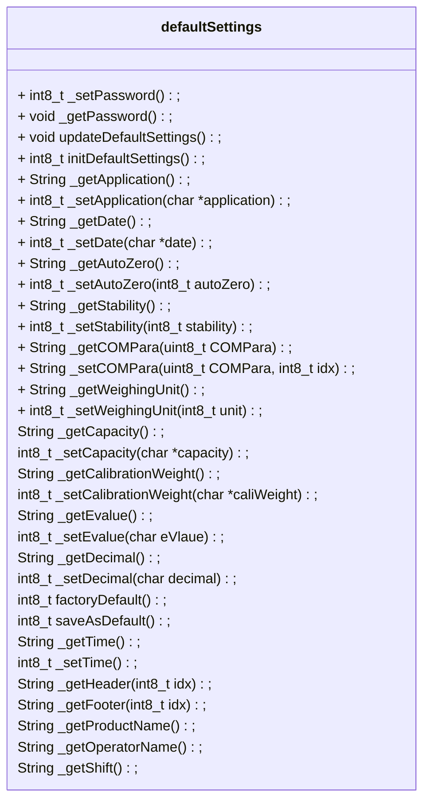

## defaultSetting.h

```mermaid
classDiagram

class defaultSettings{
   + int8_t _setPassword();
   + void _getPassword();

   + void updateDefaultSettings( );
   + int8_t initDefaultSettings( );

   + String _getApplication();
   + int8_t _setApplication( char *application );

   + String _getDate();
   + int8_t _setDate(char *date);

  +  String _getAutoZero();
  +  int8_t _setAutoZero( int8_t autoZero );

  +  String  _getStability();
  + int8_t  _setStability( int8_t stability );

   + String  _getCOMPara( uint8_t COMPara);
  +  String  _setCOMPara( uint8_t COMPara,   int8_t idx );

  +  String _getWeighingUnit();
   + int8_t _setWeighingUnit( int8_t unit );

    String _getCapacity();
    int8_t _setCapacity( char *capacity );

    String _getCalibrationWeight();
    int8_t _setCalibrationWeight(char *caliWeight );

    String _getEvalue();
    int8_t _setEvalue( char eVlaue );

    String _getDecimal();
    int8_t _setDecimal( char decimal );

    int8_t factoryDefault();
    int8_t saveAsDefault();

    String _getTime();
    int8_t _setTime();

    String _getHeader(int8_t idx );
    String _getFooter(int8_t idx);

    String _getProductName();
    String _getOperatorName();
    String _getShift();
}
```

