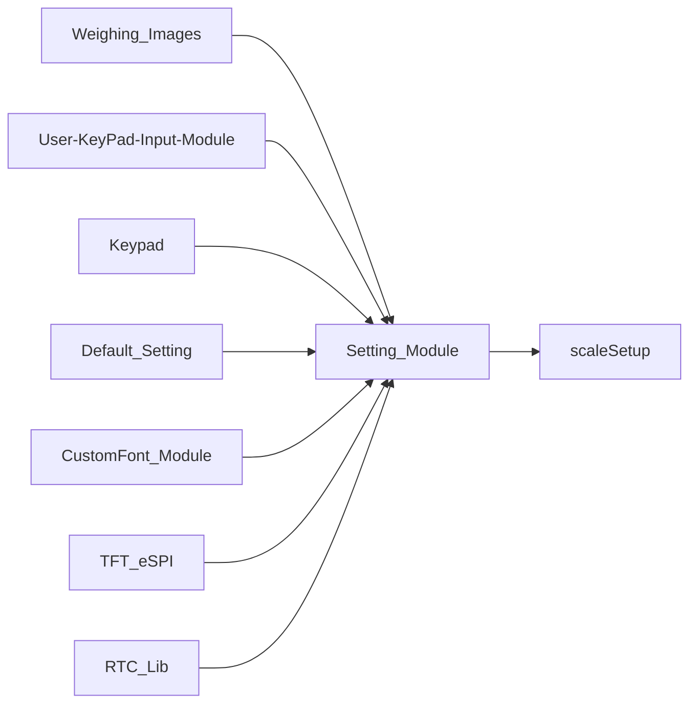

## Library Inheritance 

### setting Module

```mermaid
flowchart LR
Weighing_Images-->Setting_Module;
User-KeyPad-Input-Module-->Setting_Module;
Keypad-->Setting_Module;
Default_Setting-->Setting_Module;
CustomFont_Module-->Setting_Module;
TFT_eSPI-->Setting_Module;
RTC_Lib-->Setting_Module;
Setting_Module-->scaleSetup;
```

### 