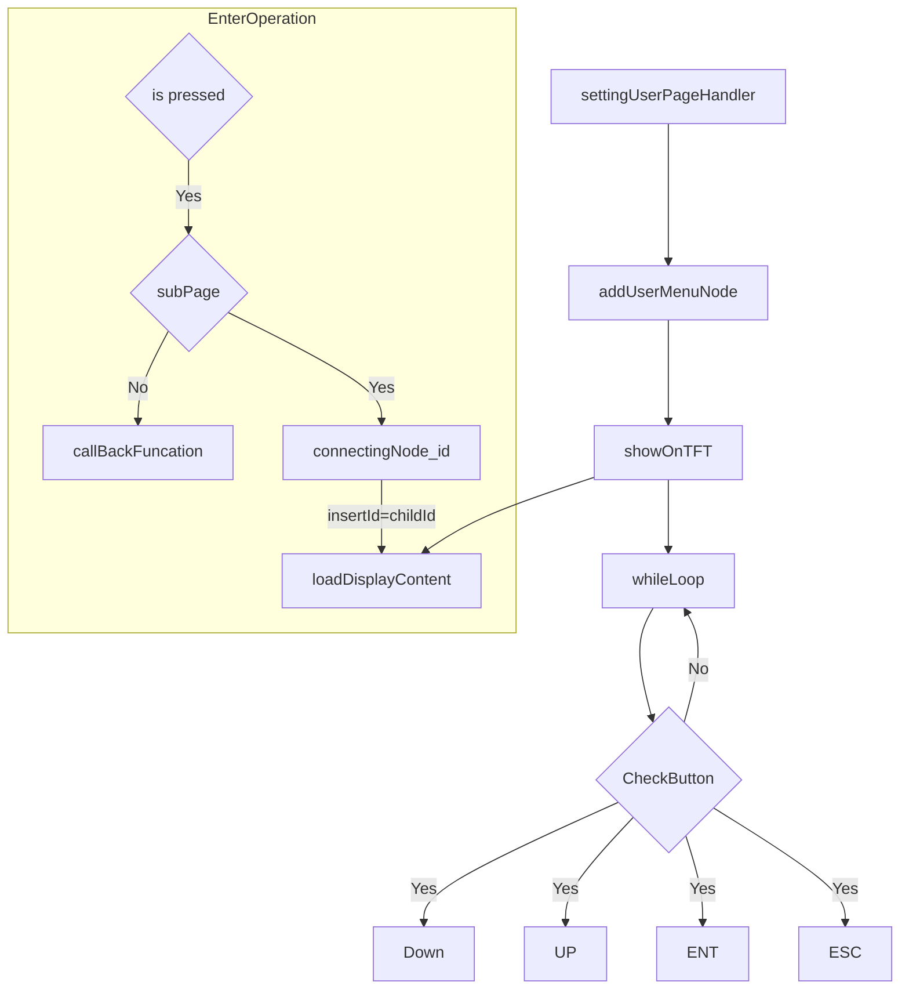

```mermaid
flowchart TB
settingUserPageHandler-->addUserMenuNode-->showOnTFT-->loadDisplayContent;
    showOnTFT-->whileLoop;
	whileLoop-->switch;
	switch{CheckButton}-- Yes -->Down;
	switch-- Yes -->UP;
	switch--Yes -->ENT;
	switch--Yes -->ESC;
	switch--No -->whileLoop	
	subgraph EnterOperation
	Enter{is pressed}--Yes -->check{subPage}--No -->callBackFuncation;
	check--Yes -->connectingNode_id--insertId=childId-->loadDisplayContent;
	end
	
	
    
```

