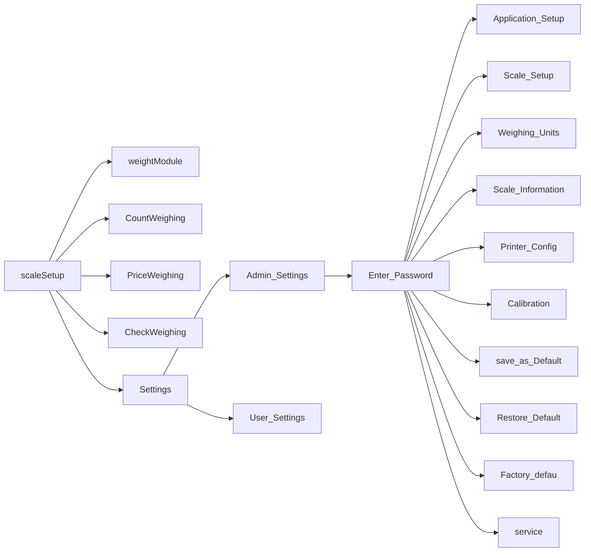

:bow_and_arrow: Please Use **Typora** application to see Diagrams.

```mermaid
flowchart LR

scaleSetup-->weightModule;
scaleSetup-->CountWeighing;
scaleSetup-->PriceWeighing;
scaleSetup-->CheckWeighing;
scaleSetup-->Settings-->Admin_Settings-->Enter_Password-->Application_Setup;
Settings-->User_Settings;
Enter_Password-->Scale_Setup;
Enter_Password-->Weighing_Units;
Enter_Password-->Scale_Information;
Enter_Password-->Printer_Config;
Enter_Password-->Calibration;
Enter_Password-->save_as_Default;
Enter_Password-->Restore_Default;
Enter_Password-->Factory_defau;
Enter_Password-->service;

```

